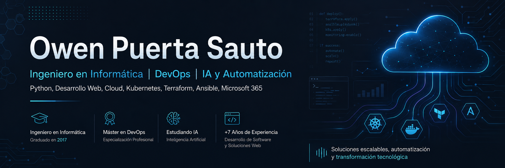

# !Hola, mi nombre es Owen Puerta Sauto 👋

  

 

Ingeniero en Informática, graduado en 2017, con más de 8 años de experiencia en desarrollo de software, desarrollo web, ingeniería de sistemas y automatización de procesos tecnológicos.

He trabajado con tecnologías como Python, JavaScript, HTML, CSS, Tailwind CSS, React.js, Node.js, Astro, Django y herramientas del ecosistema DevOps. También cuento con experiencia en Git, GitHub, Docker, Kubernetes, Terraform, Ansible, Packer, CI/CD, cloud computing y administración de servicios Microsoft 365.

Finalicé un Máster en DevOps, donde profundicé en automatización de infraestructura, despliegue continuo, contenedores, Kubernetes, observabilidad, seguridad y arquitecturas cloud. Actualmente curso formación de posgrado en Inteligencia Artificial aplicada y automatizaciones, con foco en integrar IA generativa, agentes inteligentes y flujos automatizados en entornos profesionales.

Mi enfoque combina desarrollo, infraestructura, automatización e inteligencia artificial para crear soluciones funcionales, escalables y seguras.

En este espacio comparto proyectos, prácticas, laboratorios y soluciones relacionadas con desarrollo web, DevOps, cloud, automatización, inteligencia artificial y Microsoft 365.

### Áreas de interés

- Desarrollo web y backend.
- Automatización de procesos.
- DevOps y CI/CD.
- Kubernetes y contenedores.
- Infraestructura como código.
- Cloud computing.
- Inteligencia Artificial Generativa.
- Microsoft 365 y Power Platform.
- Seguridad, monitoreo y mejora continua.

 🚀 ¡Bienvenido/a a mi repositorio!

# Lenguajes, Tecnologías y Herramientas:

  <!--<a href="https://go-skill-icons.vercel.app/">-->
    
  </a>

# Puedes encontrarme en mis redes sociales:

<!---->
<!-- -->
<!---->
<!---->

